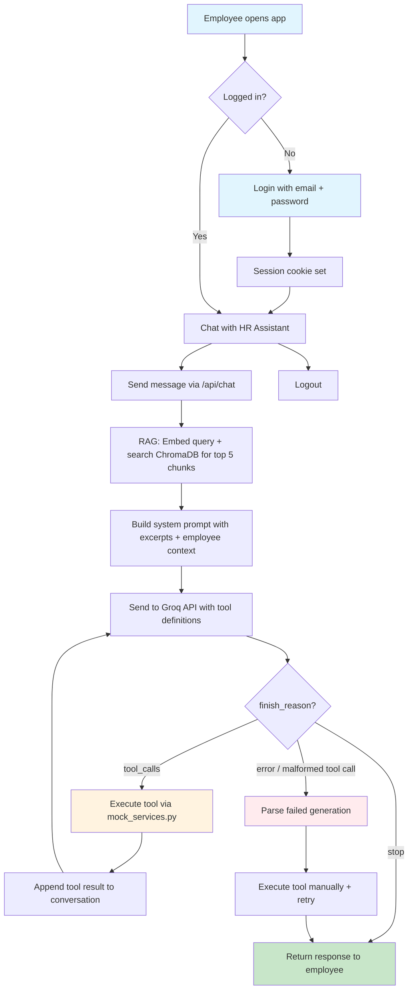
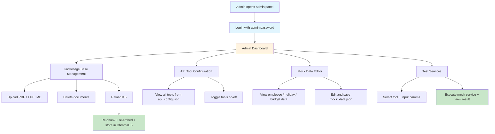
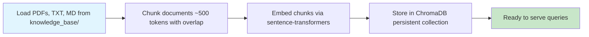
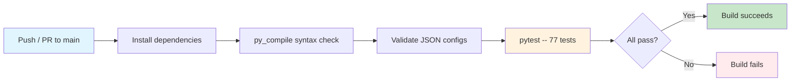

# Trenkwalder HR Assistant

An AI-powered HR chatbot that answers employee questions using company documents and real-time employee data. Built with Python, FastAPI, Groq (Llama 3.3), and a vanilla JS frontend.

## Features

- **RAG Knowledge Base** -- Upload PDF, TXT, or Markdown documents; they're chunked, embedded, and stored in ChromaDB. The chatbot retrieves only the most relevant excerpts per query using semantic search.
- **Tool-Use (Agentic)** -- The LLM autonomously decides when to fetch live data (vacation balance, learning budget, holidays, employee info) via Groq's native function calling.
- **Employee Login** -- Employees sign in with email/password to get personalized answers tied to their profile.
- **Admin Panel** -- Password-protected panel to manage knowledge base files, toggle API tools on/off, edit mock data, and test services.
- **MCP-Inspired API Config** -- Tools are defined in `api_config.json` with metadata (category, enabled flag, production endpoint), making it easy to swap mock services for real APIs.

## Quick Start

### Using uv (recommended)

[uv](https://docs.astral.sh/uv/) is a fast Python package and project manager. It handles virtual environments and dependency installation in one step.

```bash
# 1. Clone and enter the project
git clone <repo-url>
cd Chatbot

# 2. Install dependencies (creates .venv automatically)
uv sync

# 3. Set your Groq API key (free at https://console.groq.com)
# Windows CMD:
set GROQ_API_KEY=gsk_...
# Windows PowerShell:
$env:GROQ_API_KEY = "gsk_..."
# macOS/Linux:
export GROQ_API_KEY=gsk_...

# 4. Start the server
uv run python server.py

# 5. Open http://localhost:8000
```

### Using pip

```bash
# 1. Clone and enter the project
git clone <repo-url>
cd Chatbot

# 2. Create a virtual environment
python -m venv .venv
# Windows:
.venv\Scripts\activate
# macOS/Linux:
source .venv/bin/activate

# 3. Install dependencies
pip install -r requirements.txt

# 4. Set your Groq API key (free at https://console.groq.com)
# Windows CMD:
set GROQ_API_KEY=gsk_...
# Windows PowerShell:
$env:GROQ_API_KEY = "gsk_..."
# macOS/Linux:
export GROQ_API_KEY=gsk_...

# 5. Start the server
python server.py

# 6. Open http://localhost:8000
```

**Admin password:** `1243`

### Demo Credentials

| Employee | Email | Password |
|----------|-------|----------|
| Alice Mueller | alice@trenkwalder.com | alice123 |
| Bob Schmidt | bob@trenkwalder.com | bob123 |

## Project Structure

```
├── server.py              # FastAPI app -- all API endpoints
├── chatbot.py             # Groq agentic loop with tool-use + error recovery
├── rag_engine.py          # RAG pipeline -- chunking, embedding, ChromaDB retrieval
├── tools.py               # Loads api_config.json, builds Groq tool definitions
├── mock_services.py       # Mock HR/finance services from mock_data.json
├── document_loader.py     # PDF/TXT/MD document ingestion
├── main.py                # Alternative CLI entry point
├── frontend.html          # Single-page app (chat + admin panel)
├── api_config.json        # MCP-inspired tool registry (toggleable)
├── mock_data.json         # Employee/holiday/budget mock data
├── requirements.txt       # Python dependencies (pip)
├── pyproject.toml         # Project metadata + uv config
├── uv.lock                # uv lockfile (pinned dependency versions)
├── tests/
│   ├── test_document_loader.py  # Document loading tests
│   ├── test_mock_services.py    # Mock service tests
│   ├── test_rag_engine.py       # RAG chunking/retrieval tests
│   ├── test_server.py           # FastAPI endpoint tests
│   └── test_tools.py            # Tool config tests
├── .github/
│   └── workflows/
│       └── ci.yml         # GitHub Actions CI pipeline
└── knowledge_base/
    ├── benefits_guide.txt
    ├── company_handbook.md
    └── it_security_policy.pdf
```

## Architecture

### Employee Flow



### Admin Flow



### Startup / KB Reload



### CI/CD Pipeline (GitHub Actions)

Runs automatically on every push/PR to `main` (Python 3.11 + 3.12):



### Key Design Decisions

**1. RAG with Semantic Search**

Documents are chunked (~500 tokens with overlap), embedded using sentence-transformers (all-MiniLM-L6-v2), and stored in ChromaDB. On each chat message, the user's query is embedded and the top 5 most relevant chunks are retrieved via cosine similarity. Only these chunks are included in the system prompt, keeping token usage efficient and enabling the system to scale to larger knowledge bases.

**2. LLM-Driven Tool Selection**

Instead of keyword matching ("if user says vacation -> call API"), we let the LLM decide when to call tools based on natural language understanding. This handles paraphrasing, ambiguity, and multi-tool queries naturally.

**3. MCP-Inspired Configuration**

`api_config.json` defines each tool as a resource with metadata:

```json
{
  "name": "get_vacation_balance",
  "enabled": true,
  "category": "HR",
  "description": "Get vacation day balance...",
  "parameters": { ... },
  "production_endpoint": "https://hr-api.example.com/v1/vacation/{employee_id}"
}
```

Admins can toggle tools on/off at runtime. The `production_endpoint` field documents where the real API would be, making the transition from mock to production straightforward.

**4. Groq Error Recovery**

Groq's Llama models occasionally generate malformed tool calls (XML-style instead of JSON). The chatbot detects these, parses the intended function call from the error response, executes it manually, and falls back to a no-tools completion to deliver the answer. This makes the system resilient to intermittent Groq API issues.

**5. Separation of Data and Logic**

- `mock_data.json` -- all employee/holiday/budget data (editable via admin)
- `api_config.json` -- tool definitions and toggles (editable via admin)
- `mock_services.py` -- pure functions that read from the JSON data

This separation means admins can change data and tool configuration without touching code.

## API Endpoints

### Public

| Method | Endpoint | Description |
|--------|----------|-------------|
| `GET` | `/` | Serve the frontend SPA |
| `POST` | `/api/chat` | Send a chat message, get AI response |
| `POST` | `/api/reset` | Reset conversation history |
| `POST` | `/api/employee/login` | Employee login (email + password) |
| `GET` | `/api/employee/me` | Get current employee info |
| `POST` | `/api/employee/logout` | Employee logout |

### Admin (requires authentication)

| Method | Endpoint | Description |
|--------|----------|-------------|
| `POST` | `/api/admin/login` | Admin login |
| `GET` | `/api/admin/check` | Check admin session |
| `GET` | `/api/admin/files` | List knowledge base files |
| `POST` | `/api/admin/upload` | Upload a KB document |
| `DELETE` | `/api/admin/files/{name}` | Delete a KB document |
| `POST` | `/api/admin/reload` | Reload chatbot with updated KB |
| `GET` | `/api/admin/api-config` | Get tool configuration |
| `PUT` | `/api/admin/api-config/tools/{name}` | Toggle a tool on/off |
| `GET` | `/api/admin/mock-data` | Get mock data JSON |
| `PUT` | `/api/admin/mock-data` | Update mock data |
| `POST` | `/api/admin/test-service/{name}` | Test a mock service |

## Adding New Tools

1. Add a service function in `mock_services.py` and register it in `SERVICE_REGISTRY`.
2. Add mock data to `mock_data.json` if needed.
3. Add a tool entry to `api_config.json` with name, description, and parameters.

The chatbot automatically picks up new tools on reload.

## Adding Documents

Drop `.pdf`, `.txt`, or `.md` files into `knowledge_base/`, then click "Reload KB" in the admin panel (or restart the server).

## Testing

The project uses [pytest](https://docs.pytest.org/) with 77 tests covering all modules:

```bash
# Run all tests
uv run pytest
# or without uv:
python -m pytest

# Run with verbose output
uv run pytest -v

# Run a specific test file
uv run pytest tests/test_rag_engine.py
```

| Test File | Coverage |
|-----------|----------|
| `test_document_loader.py` | Document loading, format support, error handling |
| `test_mock_services.py` | All 4 HR services, dispatch registry, name lookup |
| `test_rag_engine.py` | Chunking, indexing, retrieval (dental, vacation, security), formatting |
| `test_server.py` | All API endpoints, admin/employee auth, CRUD operations |
| `test_tools.py` | API config loading, Groq tool format, enable/disable |

CI runs all tests automatically on push/PR via GitHub Actions (Python 3.11 + 3.12).

## Environment Variables

| Variable | Required | Description |
|----------|----------|-------------|
| `GROQ_API_KEY` | Yes | Groq API key (free at console.groq.com) |

## Tech Stack

| Component | Technology |
|-----------|-----------|
| Runtime | Python 3.11+, [uv](https://docs.astral.sh/uv/) (package manager) |
| Backend | [FastAPI](https://fastapi.tiangolo.com/) + Uvicorn |
| LLM | Groq API (llama-3.3-70b-versatile) |
| Embeddings | sentence-transformers (all-MiniLM-L6-v2, local) |
| Vector Store | ChromaDB (persistent, file-based) |
| PDF Parsing | pypdf |
| Frontend | Vanilla HTML/CSS/JS (single file SPA) |
| Auth | Cookie-based sessions (in-memory) |
| Testing | [pytest](https://docs.pytest.org/) (77 tests) |
| CI/CD | GitHub Actions (lint + test, Python 3.11/3.12) |
